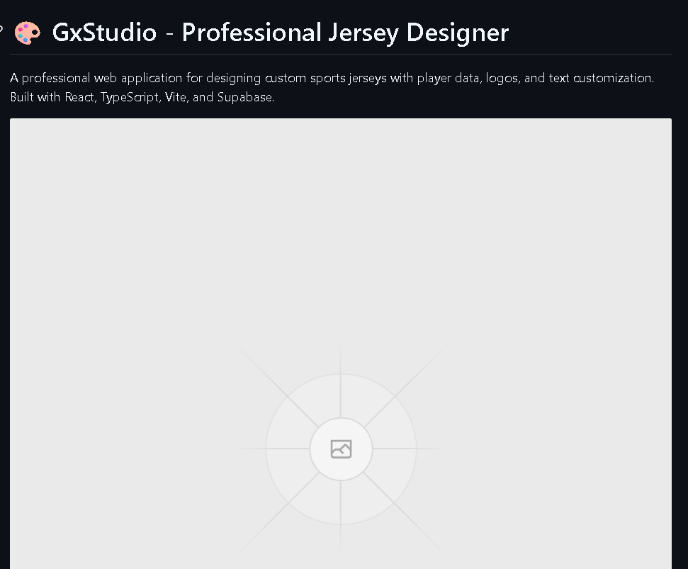

# 🎨 GxStudio - Professional Jersey Designer

A professional web application for designing custom sports jerseys with player data, logos, and text customization. Built with React, TypeScript, Vite, and Supabase.



## ✨ Features

- **🖼️ Image Upload**: Import jersey templates and customize them
- **📊 Excel Integration**: Bulk import player data via Excel/CSV files
- **🎨 Canvas Editor**: Advanced fabric.js-based canvas for precise customization
- **✏️ Text & Logo**: Add custom text, numbers, and logos to jerseys
- **💾 Batch Export**: Export individual or batch jersey designs
- **🔐 Authentication**: Secure user authentication with Supabase
- **🎁 Free Trial**: 5 free exports for new users
- **📱 Responsive**: Works seamlessly on desktop and mobile devices

## 🚀 Quick Start

### Prerequisites

- Node.js 18+ or Bun
- npm or bun package manager
- Supabase account (for authentication and database)

### Installation

```bash
# Clone the repository
git clone https://github.com/yourusername/GxStudio.git
cd GxStudio

# Install dependencies
npm install
# or
bun install

# Set up environment variables
cp .env.example .env
# Edit .env with your Supabase credentials

# Start development server
npm run dev
# or
bun dev
```

Visit `http://localhost:8080` to see the application.

## 🔧 Environment Variables

Create a `.env` file in the root directory:

```env
VITE_SUPABASE_URL=your-supabase-project-url
VITE_SUPABASE_ANON_KEY=your-supabase-anon-key
```

## 📦 Build for Production

```bash
# Build the application
npm run build

# Preview production build locally
npm run preview
```

## 🌐 Deployment

### Deploy to Vercel (Recommended)

1. **Push to GitHub**:
   ```bash
   git init
   git add .
   git commit -m "Initial commit"
   git remote add origin https://github.com/yourusername/DotStitch.git
   git push -u origin main
   ```

2. **Deploy on Vercel**:
   - Go to [vercel.com](https://vercel.com)
   - Click "Add New Project"
   - Import your GitHub repository
   - Add environment variables:
     - `VITE_SUPABASE_URL`
     - `VITE_SUPABASE_ANON_KEY`
   - Click "Deploy"

3. **Configure Supabase**:
   - Go to Supabase Dashboard → Settings → API
   - Add your Vercel URL to "Site URL" and "Redirect URLs"
   - Example: `https://your-app.vercel.app`

### Deploy to Other Platforms

The app can also be deployed to:
- **Netlify**: Similar process to Vercel
- **Cloudflare Pages**: Connect GitHub repo and set build command
- **AWS Amplify**: Import from GitHub and configure build settings

## 🗄️ Database Setup

Run the following SQL scripts in your Supabase SQL Editor:

1. **Points System**: `supabase-schema-points.sql`
2. **OTP System**: `supabase-schema-otp.sql`
3. **Points Update**: `supabase-schema-points-update.sql`

## 📁 Project Structure

```
GxStudio/
├── src/
│   ├── components/      # Reusable UI components
│   ├── pages/          # Page components
│   │   ├── HomePage.tsx
│   │   └── steps/      # Multi-step wizard
│   ├── lib/            # Utilities and helpers
│   ├── hooks/          # Custom React hooks
│   └── main.tsx        # Application entry point
├── public/             # Static assets
├── dist/               # Production build output
├── vercel.json         # Vercel configuration
├── vite.config.ts      # Vite configuration
└── package.json        # Dependencies and scripts
```

## 🛠️ Available Scripts

```bash
# Development
npm run dev              # Start dev server
npm run build            # Build for production
npm run preview          # Preview production build
npm run lint             # Run ESLint

# Deployment
npm run deploy           # Deploy to Vercel (requires Vercel CLI)

# Utilities
npm run setup-images     # Setup image assets
npm run optimize-images  # Image optimization guide
```

## 🎨 Tech Stack

- **Frontend**: React 18, TypeScript
- **Build Tool**: Vite 5
- **Styling**: Tailwind CSS
- **UI Components**: Radix UI, shadcn/ui
- **Canvas**: Fabric.js
- **Authentication**: Supabase Auth
- **Database**: Supabase (PostgreSQL)
- **State Management**: React Query (TanStack Query)
- **File Processing**: xlsx, file-saver, jszip
- **Routing**: React Router v6

## 🔒 Security

- Environment variables are never committed to the repository
- Supabase Row Level Security (RLS) enabled
- Authentication required for premium features
- Secure OTP verification system

## 📝 License

This project is private and proprietary.

## 👨‍💻 Author

**GX Developer**

## 🤝 Support

For support, please contact the development team or open an issue in the repository.

## 🎯 Roadmap

- [ ] Add more jersey templates
- [ ] Implement team management
- [ ] Add payment integration
- [ ] Mobile app version
- [ ] Advanced design tools
- [ ] Template marketplace

---

**Made with ❤️ by GX Developer**
