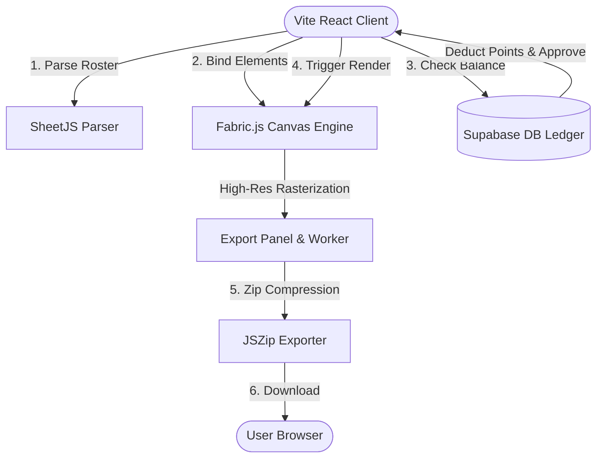

<div align="center">
  <h1>GxDrip</h1>
  <p><strong>Professional Jersey Print Studio Engine & Roster Customization Tool</strong></p>

  <p>
    <a href="#-overview">Overview</a> •
    <a href="#-core-features">Features</a> •
    <a href="#-tech-stack--architecture">Tech Stack & Architecture</a> •
    <a href="#-repository-structure">Repository Structure</a> •
    <a href="#-installation--setup">Installation & Setup</a> •
    <a href="#-database-schema">Database Schema</a> •
    <a href="#-configuration--security">Configuration & Security</a>
  </p>

  
  
  
  
  
  
</div>

---

## 📖 Overview

**GxDrip** is an enterprise-grade jersey print studio engine engineered specifically for custom sportswear manufacturers and sublimated apparel shops. It replaces manual artwork mapping with a highly optimized, canvas-based bulk processor.

By harnessing a customized **Fabric.js** canvas environment, design shops can rapidly upload entire team rosters (names, numbers, sizes) via Excel/CSV, instantly preview them on high-fidelity mockups, and run high-resolution rasterizations reaching **600 DPI**—production-ready for full-size garments. The entire flow is backed by a secure **Supabase** points ledger to ensure credit integrity.

---

## ✨ Core Features

- **⚡ Bulk Roster Processing:** Parse team rosters from `.xlsx` or `.csv` spreadsheets instantly. Automatically map name/number pairs onto canvas layouts to generate hundreds of individual player jerseys.
- **🎨 Interactive Fabric Canvas:** Custom-built designer workspace supporting drag-and-drop text fields, constraint bounds, customizable font styling, custom color fills, and vector branding logo integrations.
- **🖨️ Production-Grade Exports:**
  - **Standard (300 DPI):** Optimized for digital previews and client mockups.
  - **High (450 DPI):** Balanced resolution for smaller print formats.
  - **Ultra (600 DPI):** High-density vector rasterization explicitly sized for large-format sublimation printing on 36"+ jerseys.
- **🔒 Ledger-Backed Security:** Deductions are verified atomically through a secure database function in Supabase. Credits are debited from the profile ledger *before* high-resolution files are generated, blocking client-side download bypasses.
- **💾 Session Auto-Recovery:** Robust local session saving ensures that active roster configurations, customized positions, and canvas modifications are preserved through unexpected page reloads.

---

## 🛠️ Tech Stack & Architecture

GxDrip is constructed with a highly responsive React SPA architecture linked to containerized cloud databases and static assets.

### The Stack
* **Frontend Framework:** React 18, Vite, TypeScript
* **Canvas Manipulation:** Fabric.js 5+
* **Styling & UI Library:** Tailwind CSS, Shadcn UI, Radix UI primitives
* **Database & Auth:** Supabase (PostgreSQL with RLS policy locks)
* **Packaging Utilities:** SheetJS (Excel parser), JSZip (bulk export compressor), FileSaver

### System Architecture Diagram


```mermaid
graph TD
    Client([Vite React Client]) -->|1. Parse Roster| ExcelParser[SheetJS Parser]
    Client -->|2. Bind Elements| CanvasEngine[Fabric.js Canvas Engine]
    Client -->|3. Check Balance| SupabaseDB[(Supabase DB Ledger)]
    SupabaseDB -->|Deduct Points & Approve| Client
    Client -->|4. Trigger Render| CanvasEngine
    CanvasEngine -->|High-Res Rasterization| ExportPanel[Export Panel & Worker]
    ExportPanel -->|5. Zip Compression| ZipExporter[JSZip Exporter]
    ZipExporter -->|6. Download| User([User Browser])
```

---

## 📁 Repository Structure

The project directory is structured cleanly to separate design components, canvas layout scripts, and database schema definition files:

```text
GxStudioStitch-main/          <-- Root Repository Directory
├── public/                   <-- Static files, custom fonts, and system logos
├── src/                      <-- Source code
│   ├── components/           # UI elements (auth panels, control panels, menus)
│   ├── hooks/                # Custom React hooks (authentication, canvas bindings)
│   ├── lib/                  # Library clients (Supabase setup, performance monitoring)
│   ├── pages/                # Primary dashboard screens and landing layout
│   │   └── steps/            # Interactive step-by-step jersey generation wizard
│   ├── types/                # Strict TypeScript interface declarations
│   └── utils/                # Utility helpers (DPI math, state loaders)
├── supabase/                 # PostgreSQL migration files and database schemas
├── index.html                # Vite SPA template entrypoint
├── package.json              # Workspace package definitions
└── tailwind.config.ts        # Design tokens and theme settings
```

---

## 🚀 Installation & Setup

Set up your local workspace in minutes by following these steps.

### 1. Prerequisites
Ensure you have the following installed:
* **Node.js (v18 or higher)**
* **NPM**
* A configured **Supabase** database instance (or run locally in demo mode)

### 2. Local Workspace Setup

#### A. Clone the Repository
```bash
git clone https://github.com/Naval721/T2.git
cd T2
```

#### B. Install Dependencies
```bash
npm install
```

#### C. Environment Configuration
Create a `.env` file in the root directory:
```env
VITE_SUPABASE_URL=your-supabase-project-url
VITE_SUPABASE_ANON_KEY=your-supabase-anon-key
```
> [!NOTE]
> If you start the app without setting these environment variables, GxDrip automatically falls back to **Demo Mode** which runs purely local configurations.

#### D. Start the Local Server
```bash
npm run dev
```
Open [http://localhost:5173](http://localhost:5173) in your browser.

---

## 🗄️ Database Schema

Database triggers, functions, and layout definitions are stored inside the `/supabase` folder. 

Initialize these tables in your database instance to enable credit deduction features:
* **`user_profiles`**: Linked to Auth users; hosts email, display name, and active `points_balance`.
* **`points_transactions`**: Encapsulates ledger integrity tracking point purchases and rendering debits.

---

## 🔧 Configuration & Security

> [!WARNING]
> **Production Safety Reminder:** Never commit active access keys, environment credentials, or private secrets to version control. Always utilize cloud key vaults or ignored environment files.

| Variable Name | Default Dev Fallback (Safe) | Description / Purpose |
|---|---|---|
| `VITE_SUPABASE_URL` | *None* | Target endpoints for your Supabase backend client |
| `VITE_SUPABASE_ANON_KEY` | *None* | Public API anon keys used to interact with database routes |

---

<div align="center">
  <sub>Built with precision and scalability by the Gx Developers Organization.</sub>
</div>
